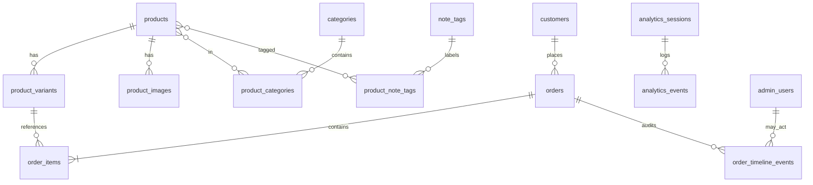

# Lagari — MVP data model (ERD)

**Version:** P1 (2026-06-04)  
**Database:** PostgreSQL 15+

## Entity diagram

## Tables

### `categories`

| Column | Type | Notes |
|--------|------|-------|
| id | uuid PK | |
| slug | text UNIQUE | `for-men`, `for-women`, `unisex`, `all` |
| name | text | Display label |

### `note_tags`

| Column | Type | Notes |
|--------|------|-------|
| id | uuid PK | |
| slug | text UNIQUE | `oud`, `citrus`, `floral`, `woody`, `gourmand` |
| name | text | |

### `products`

| Column | Type | Notes |
|--------|------|-------|
| id | uuid PK | |
| slug | text UNIQUE | URL segment |
| title | text | |
| description | text | Rich text / HTML |
| designer_inspiration | text | FR-5 |
| scent_profile | enum | `light`, `dark` — V1 color morph |
| top_notes | text | V1 pyramid |
| heart_notes | text | |
| base_notes | text | |
| is_published | boolean | |
| deleted_at | timestamptz NULL | Soft delete FR-1 |
| created_at | timestamptz | |
| updated_at | timestamptz | |

### `product_categories` (M:N)

`product_id`, `category_id` — composite PK.

### `product_note_tags` (M:N)

`product_id`, `note_tag_id` — composite PK.

### `product_variants`

| Column | Type | Notes |
|--------|------|-------|
| id | uuid PK | |
| product_id | uuid FK | |
| sku | text UNIQUE | |
| name | text | e.g. "50ml Extrait" |
| price_pkr | integer | Whole rupees |
| compare_at_price_pkr | integer NULL | |
| stock | integer | |
| low_stock_threshold | integer | FR-C3 default 10 |
| is_active | boolean | |

### `product_images`

| Column | Type | Notes |
|--------|------|-------|
| id | uuid PK | |
| product_id | uuid FK | |
| url | text | Cloudinary URL |
| sort_order | int | |
| is_hero | boolean | |

### `customers`

| Column | Type | Notes |
|--------|------|-------|
| id | uuid PK | |
| phone | text UNIQUE | Primary identity PK market |
| full_name | text | Latest checkout name |
| email | text NULL | |
| rto_count | int DEFAULT 0 | V1 risk FR-O2 |
| created_at | timestamptz | |

### `orders`

| Column | Type | Notes |
|--------|------|-------|
| id | uuid PK | |
| order_number | serial UNIQUE | Human #1042 |
| customer_id | uuid FK | |
| session_id | uuid NULL | Attribution |
| status | enum | `pending`, `confirmed`, `shipped`, `delivered`, `rto` |
| subtotal_pkr | integer | |
| discount_pkr | integer DEFAULT 0 | |
| total_pkr | integer | |
| shipping_city | text | |
| shipping_address | text | |
| notes | text NULL | |
| created_at | timestamptz | |
| updated_at | timestamptz | |

### `order_items`

| Column | Type | Notes |
|--------|------|-------|
| id | uuid PK | |
| order_id | uuid FK | |
| variant_id | uuid FK | |
| product_title_snapshot | text | |
| variant_name_snapshot | text | |
| unit_price_pkr | integer | |
| quantity | int | |

### `order_timeline_events` (FR-O3)

| Column | Type | Notes |
|--------|------|-------|
| id | uuid PK | |
| order_id | uuid FK | |
| actor_admin_id | uuid NULL | |
| event_type | text | `placed`, `status_changed`, `note` |
| from_status | text NULL | |
| to_status | text NULL | |
| message | text | |
| created_at | timestamptz | Immutable |

### `analytics_sessions` (FR-4)

| Column | Type | Notes |
|--------|------|-------|
| id | uuid PK | Matches Redis session id |
| started_at | timestamptz | |
| last_activity_at | timestamptz | |
| ended_at | timestamptz NULL | |
| user_agent | text NULL | |
| referrer | text NULL | |

### `analytics_events`

| Column | Type | Notes |
|--------|------|-------|
| id | uuid PK | |
| session_id | uuid FK | |
| event_name | text | `page_view`, `add_to_cart`, `checkout_start`, `order_placed` |
| payload | jsonb | |
| created_at | timestamptz | |

### `admin_users` (FR-D5)

| Column | Type | Notes |
|--------|------|-------|
| id | uuid PK | |
| email | text UNIQUE | |
| password_hash | text | bcrypt |
| created_at | timestamptz | |

### `url_redirects` (FR-M2)

| Column | Type | Notes |
|--------|------|-------|
| id | uuid PK | |
| from_path | text UNIQUE | Old Shopify path |
| to_path | text | New path |
| status_code | int DEFAULT 301 | |

## Indexes (recommended)

- `products(slug)`, `products(designer_inspiration)` WHERE deleted_at IS NULL
- `orders(status, created_at DESC)`
- `customers(phone)`
- `analytics_events(session_id, created_at)`

## Extensibility (FR-T2)

Future non-fragrance: add `catalog_type` enum on `products` default `fragrance`; categories table already generic.
