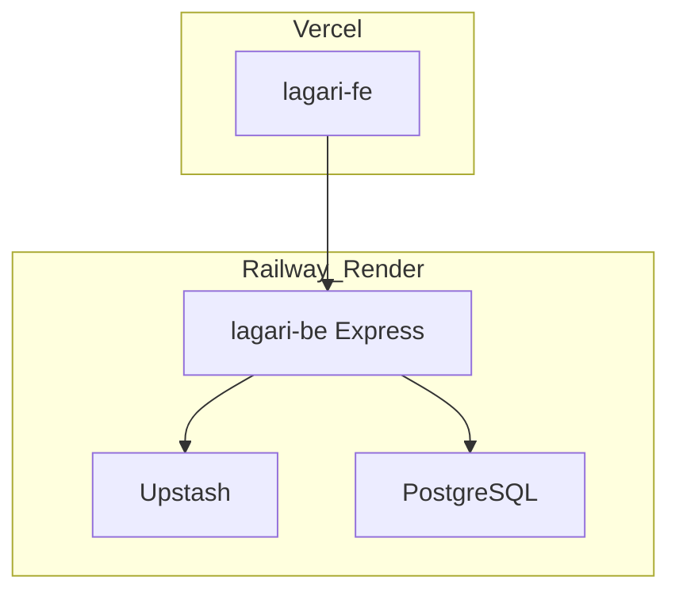

# Lagari — Platform plan (repository copy)

**Version:** P1 (2026-06-04)  
**Status:** Planning complete in repo — implementation gated until user says **execute P2+**

This document is the canonical in-repo plan. It mirrors the Cursor plan and should be updated when decisions change.

---

## 1. Vision

Lagari (lagari.pk) replaces Shopify with a decoupled luxury fragrance platform for Pakistan: impression-first catalog, COD checkout, native analytics, and an executive admin — without app-script bloat.

**Sources:** [Project Document](../source/Lagari%20Project%20Document.docx), [FR.md](../requirements/FR.md), [gap-matrix.md](../requirements/gap-matrix.md)

---

## 2. Repository map

| Path | Role |
|------|------|
| `lagari-fe/` | Next.js 16 storefront + admin UI |
| `lagari-be/` | Express API (not started) |
| `docs/plan/` | This plan, roadmap, session log |
| `docs/adr/` | Architecture decisions |
| `docs/architecture/` | ERD + OpenAPI |
| `docs/design/` | Visual direction |
| `memory-bank/` | AI session memory |

---

## 3. Architecture (decided)

- **Frontend:** Next.js on Vercel — SSR PDP, SSG policies, OG tags (NFR-2).
- **Backend:** Express on Railway/Render — orders, catalog, analytics, auth (ADR-001).
- **Data:** PostgreSQL (Neon/Supabase) + Redis Upstash (ADR-006).
- **Admin:** Single Next app, route group `(admin)/admin/*` (ADR-005).

**Not using:** Next.js as primary API; NestJS for MVP; separate admin deploy unless ops requires later.



---

## 4. Differentiators (vs Shopify / generic ecommerce)

| Theme | MVP | V1 |
|-------|-----|-----|
| Impression-first discovery | Designer inspiration field + filters | AI matcher |
| Editorial luxury UX | Design system + asymmetric PDP | GSAP landing |
| PK COD + confirm gate | One-page checkout; admin Confirmed step | RTO risk profile |
| Unified session attribution | Session + events + cart in Redis | Funnel recovery |
| Native ops | No browser tracking scripts | Slack/SMS/WhatsApp |

**Avoid:** Geist/Inter defaults, purple gradients, 3-column Shopify grids, mandatory accounts, multi-step card checkout.

---

## 5. Requirements summary

- Full list: [FR.md](../requirements/FR.md), [NFR.md](../requirements/NFR.md)
- MVP = catalog, COD, admin CRUD, order timeline, sessions, low-stock, OG metadata
- V1 = GSAP, pyramid, color morph, AI chat, live feed, notifications, Cloudinary batch

---

## 6. Implementation phases

See [ROADMAP.md](./ROADMAP.md).

| Phase | Deliverable |
|-------|-------------|
| P1 | ADRs, ERD, OpenAPI, design doc ← **current** |
| P2 | PostgreSQL + migrations |
| P3 | Express MVP API |
| P4 | Storefront |
| P5 | Admin UI |
| P6 | Migration + hardening |
| V1 | Motion, AI, notifications |

---

## 7. Frontend structure (planned)

```
lagari-fe/app/
  (storefront)/     # shop, product, checkout, policies
  (admin)/admin/    # login, dashboard, products, orders
lagari-fe/lib/      # api-client, session helpers
```

Design must follow [lagari-visual-direction.md](../design/lagari-visual-direction.md) before page implementation.

---

## 8. Backend structure (planned)

```
lagari-be/src/
  modules/ catalog | cart | orders | sessions | analytics | auth
  middleware/ jwt | rateLimit | errors
  db/ migrations
```

API contract: [openapi-mvp.yaml](../architecture/openapi-mvp.yaml)

---

## 9. Risks

| Risk | Mitigation |
|------|------------|
| Motion vs PageSpeed | MVP static-first; lazy GSAP in V1 |
| LLM cost | V1 only; cache impression index |
| SMS vendor lock-in | NotificationProvider abstraction (ADR-008) |
| Shopify SEO loss | FR-M2 redirect table |

---

## 10. Approval checklist

Before **execute P2**:

- [ ] Architecture accepted (Express + single Next app)
- [ ] Visual direction accepted
- [ ] ERD / OpenAPI reviewed
- [ ] ADRs 001–009 acceptable or annotated with changes

After approval, log decision in [SESSION-LOG.md](./SESSION-LOG.md) and update `memory-bank/activeContext.md`.
