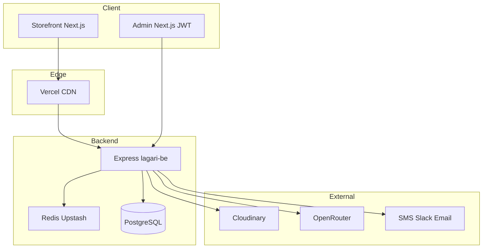

# System Patterns — Lagari

## Architecture

## Decisions (see `docs/adr/`)

- **ADR-001:** Express + TypeScript + Zod (not NestJS for MVP; not Next.js as primary API).
- **ADR-005:** Single Next app — `(storefront)` + `(admin)/admin`.
- **ADR-003:** SSE for MVP realtime; WebSockets if feed grows.
- **ADR-006:** Redis `session:{id}`, `cart:{sessionId}`, 30m idle.

## Backend layout (pern-alpha style)

- `src/routes/*Route.ts` — URL wiring only
- `src/controllers/*.controller.ts` — handler bodies
- `src/services/` — business logic
- `src/config/env.ts` + `config/config.cjs` — dotenv, PORT, DB
- See `lagari-be/STRUCTURE.md`

## Domain modules

| Module | Responsibility |
|--------|----------------|
| Catalog | Products, variants, categories, designer inspiration, soft delete |
| Cart/Session | Redis-backed cart; 30-min analytics session |
| Orders | COD pipeline, status machine, timeline audit |
| Analytics | Events, funnels, conversion, abandonment |
| Reviews | `product_reviews` table; SQL aggregates → `reviewSummary` on catalog/admin DTOs; admin queue with filters |
| Chat | OpenRouter + product card Markdown protocol (V1) |
| Notifications | Multi-channel on order create (V1) |
| Media | Cloudinary upload + transforms |

## Order state machine

`Pending` → `Confirmed` → `Shipped` → `Delivered` | `RTO`

Admin must confirm COD orders before ship (FR-D6).

## FE patterns

- SSR for PDP + OG metadata; SSG for policy/landing.
- Design tokens in `docs/design/lagari-visual-direction.md` before UI build.
- Admin JWT on `/admin-panel-route/(console)/*`.

## Error handling & resilience

Source of truth: `docs/architecture/error-resilience.md`.

- **FE precedence:** field → section (`_contact`) → form (`_form`) → toast. Never silent. HTTP `200` business warnings (eligibility `canSubmit:false`) still surface.
- **Structured first:** API responses carry `code`/`field`; map on those before message-text inference. `AppError(status, msg, { code, field })` on BE; `errorHandler` echoes them.
- **BE resilience:** `error-taxonomy.ts` (classify/transient), `retry.ts` (`withRetry` backoff+jitter, transient-only — never order/review/upload writes), pino `logger.ts`, `request-id.ts`. Crash guards in `index.ts` (unhandledRejection keep-serving; uncaughtException drain+exit; SIGTERM/SIGINT graceful).
- **Optimistic mutations** roll back in `onError`, re-sync `onSettled`.
- **Tests:** Vitest in both packages (`npm test`).

## Admin UX (handoff)

- **Theme:** `.admin-theme` dark tokens in `globals.css` — inputs `#232018`, not white.
- **Toasts:** `useAdminToast()` for success/error/warning; inline errors for forms.
- **API errors:** `ApiError` carries `payload.issues[]` with Zod paths plus optional `code`/`field`; map via `parseApiError` → `data-admin-field` + scroll.
- **Product slug:** unique in DB; duplicate returns **409** → error on `slug` field.
**Reviews:** `GET /admin/reviews` returns `{ reviews, total, page, limit }`; **tabs** — `All reviews` (default, `status=all`) and `Pending` (`?status=pending`); URL-synced filters; `product` search matches slug or title (debounced 350ms); product titles link to storefront PDP + admin edit.

## Performance

| Area | Pattern |
|------|---------|
| **Shop filters** | Client-only URL via `replaceShopUrl` — no Next.js navigation on chip/search changes; React Query fetches products |
| **Shop page RSC** | Taxonomy + default products only; `revalidate = 300` |
| **Admin products API** | Single `findAll` + `getReviewSummariesForProducts` — not per-product N+1 |
| **Admin navigation** | `loading.tsx` skeletons; shell visible during token refresh |
| **Session/cart** | Touch throttled 60s (FE + BE); cart fetch keyed on `sessionId` |
| **Catalog API** | `Cache-Control: public, max-age=60` on list/detail |
- **Docs:** `docs/architecture/admin-ux.md`

## Anti-patterns

- Heavy Shopify-style checkout with accounts/zip complexity.
- Browser-loaded third-party analytics/chat scripts.
- Geist/Inter default typography on luxury storefront.
- Schema rewrites when adding non-fragrance categories later.
